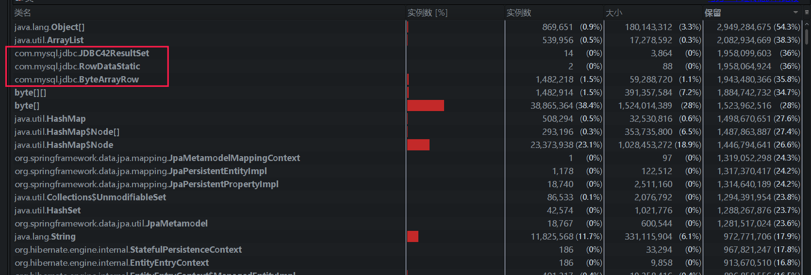
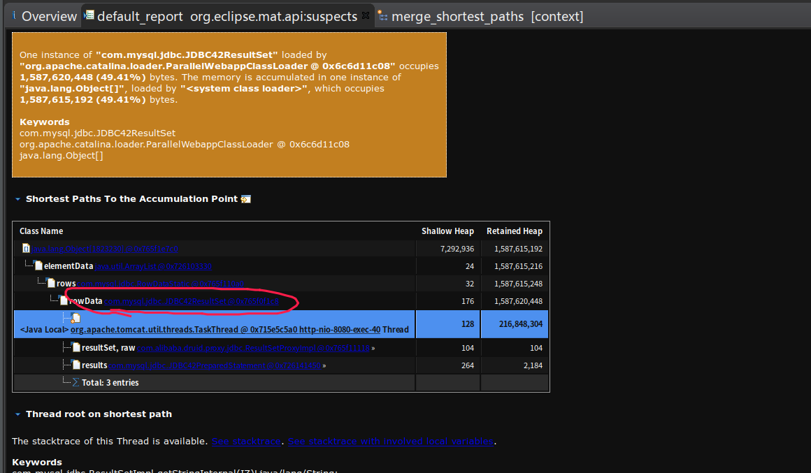
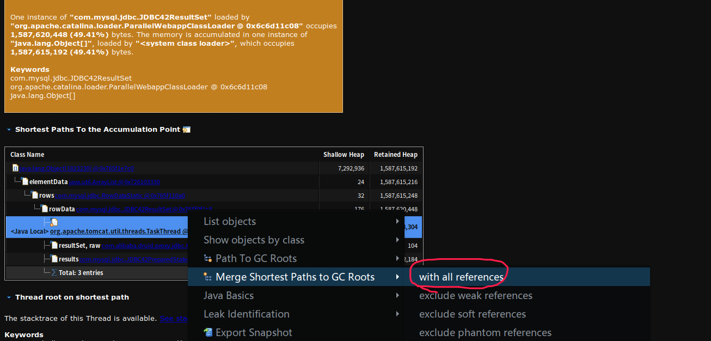
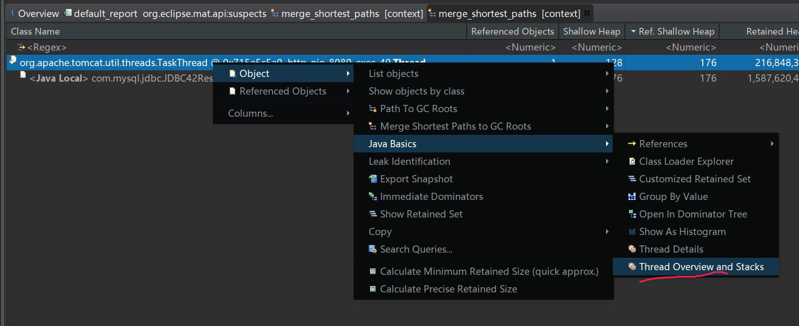

## 概要

在三月中开始的时候,线上突然经常报出 oom,刚开始怀疑那几天提交的代码有问题,因为之前没有报出来过. 代码排查了几遍,没发现有什么问题. 然后把 oom 时的内存信息 dump 下来使用 jvisualvm 进行分析,发现是 jdbc 查询时,有一个 DataResultSet 对象非常大,占用 1.9g 内存. 感觉是找到了问题的原因,但是找不到问题发生的地方,dump 下来了好几个内存快照,每次 oom 时的栈信息都不一样,但是都有这个 1.9g 的对象. 因为数据库有 600 多张表,整个系统业务很多,根本找不到是哪里查询时的占用的内存.

然后对其中一台机器尝试过进行 jvm 参数调优,调大了堆,垃圾回收器换成了 CMS+ParNew,日常这种垃圾回收器表现比未调优之前要好,但是依然报出过 oom,报 oom 那段时间一直 fgc,gc 的时间能达到三千多秒...

现在主要就是找到创建这个DataResultSet对象时的代码处.

## 过程

- 首先使用启动参数,把jvm发生oom的时候堆栈快照转储下来.
   ```shell
   -XX:+HeapDumpOnOutOfMemoryError -XX:HeapDumpPath=/ 
   ```

- 等待下一次oom发生,把发生oom时的堆栈快照拉到本地.使用jvisualvm工具进行分析.有可能堆栈快照五六个g,而jvisualvm工具默认内存好像不到一个g,直接导入的话会报错,所以需要配置jvisualvm工具的内存大小. 
   
   对应配置在jdk目录下的`lib/visualvm/etc/visualvm.conf`文件. 修改`visualvm_default_options`属性的-Xms和-Xmx值.
   ```shell
   visualvm_default_options="-J-client -J-Xms4096m -J-Xmx4096m"
   ```

- 启动之后装入对应快照文件,首先排查的是导致oom的线程栈信息. 但是根本没有自己写的代码,都是源码相关的.然后又看了其他的堆栈快照,发现每次oom时的线程栈都不一样,所以这时怀疑问题不是出在oom时的线程这,可能只是压死骆驼的最后一根稻草. 然后查看快照中的大对象信息.感觉比较可疑的就是这几个`DataResultSet`对象.但是通过jvisualvm工具查看不到对应的代码处.所以后来上网发个[求教贴](https://www.v2ex.com/t/765651#reply17)是不是思路不对.
   

   帖子中回复基本是通过MAT工具查看或者通过慢sql的角度去排查.但是生产环境不知道有没有把druid放开.所以就先通过mat去排查了.

- 因为第一次使用mat排查oom问题,所以找了两篇教程,感觉还挺好. [关于MAT的基本概念](https://juejin.cn/post/6908665391136899079#heading-4),其中关于`Shallow Heap`和`Retained Heap`等概念的讲解挺实用的.要不刚开始打开的时候一头雾水,不知道从哪下手.还有[根据大对象快速定位代码](https://blog.csdn.net/lnkToKing/article/details/103533995)的教程,就是根据这个教程定位到代码的.

  mat打开之后有`Leak Suspects`,问题怀疑点,第一个怀疑点就是关于`DataResultSet`对象的.看来之前的猜测是正确的.然后点进去追踪调用栈帧.下面是追踪过程.
  
  
  
  
  最后就看到了`DataResultSet`对象创建的整个调用栈,在栈中找到自己项目包的代码.查看有没有问题.

## 结果

最后通过调用栈中发现2月提交的一次代码中,把一个分页查询的分页条件忽略了.导致那个查询全表查了.而那个表有接近200w的数据.

以上就是一次oom的过程.